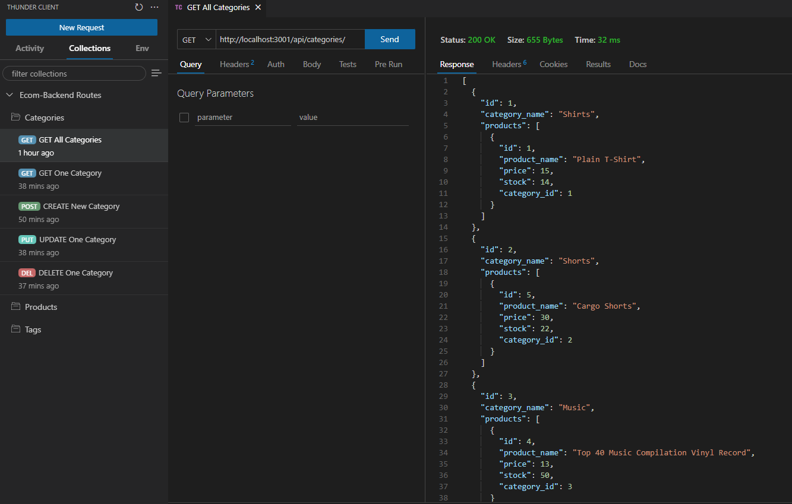

# E-Commerce Back End


## Description 

The back end for an e-commerce site. Express.js API using Sequelize to interact with a MySQL database.

## Table of Contents

- [Installation](#installation)
- [Usage](#usage)
- [Questions](#questions)
- [License](#license)

## Installation

To install necessary dependencies, run the following command:

```npm i```

## Usage

User is able to View, Create, Update and Delete Product, Categories and Tags for ecommerce database.

Link to the walkthrough video: [follow the link](https://drive.google.com/file/d/1kRu_lb5LhFqvDiOW0quPbSzomIvVELF2/view?usp=sharing)

Example output: 

 

## Questions
GitHub profile: [vlada-caban](https://github.com/vlada-caban)

## License 
License: MIT